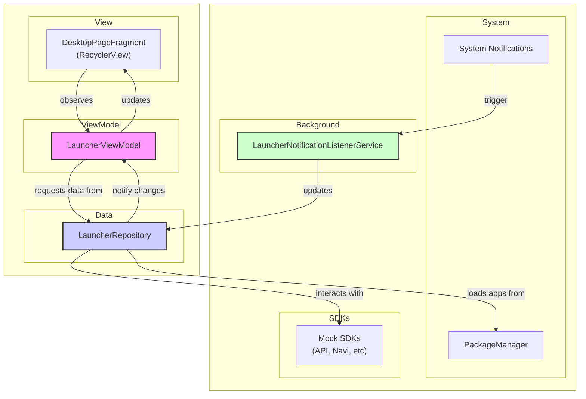

# CarLauncher 项目概览

## 1. 项目背景

本项目旨在创建一个现代化、可扩展的车载桌面（Car Launcher）应用程序。根据初始需求，该应用需要支持多屏桌面展示、应用程序启动与切换、以及桌面管理功能（如应用图标排布、小部件展示等）。

此项目的设计旨在成为一个系统级的桌面应用，能够与底层车载服务和各类 SDK（如导航、语音助手、车辆信息等）进行深度集成，为用户提供一个稳定、流畅且信息丰富的交互界面。

## 2. 技术栈

为了构建一个健壮且易于维护的应用，我们采用了 Google 推荐的现代 Android 开发技术栈：

- **编程语言**: [Kotlin](https://kotlinlang.org/) (100% Kotlin-first)
- **核心架构**:
    - [Android Jetpack](https://developer.android.com/jetpack):
        - **UI 层**: [Lifecycle](https://developer.android.com/topic/libraries/architecture/lifecycle), [ViewModel](https://developer.android.com/topic/libraries/architecture/viewmodel), [View Binding](https://developer.android.com/topic/libraries/view-binding)
        - **数据层**: [Room](https://developer.android.com/topic/libraries/architecture/room) (计划用于未来持久化)
        - **导航**: [Fragment](https://developer.android.com/guide/fragments), [ViewPager2](https://developer.android.com/jetpack/androidx/releases/viewpager2)
- **异步编程**: [Kotlin Coroutines](https://kotlinlang.org/docs/coroutines-overview.html) 和 [Flow](https://kotlinlang.org/docs/flow.html) 用于管理后台任务和处理数据流。
- **UI 组件**:
    - [Material Components](https://material.io/develop/android/docs/getting-started)
    - [RecyclerView](https://developer.android.com/guide/topics/ui/layout/recyclerview)
    - [ConstraintLayout](https://developer.android.com/training/constraint-layout)
- **依赖库**:
    - `BaseRecyclerViewAdapterHelper`: 简化 RecyclerView 适配器的编写。

## 3. 架构思想

项目严格遵循 **MVVM (Model-View-ViewModel)** 设计模式，以实现界面与业务逻辑的清晰分离。

- **View (UI 层)**: 由 `LauncherActivity`、`DesktopPageFragment` 等组成。它们只负责展示数据和发送用户事件，不包含任何业务逻辑。UI 通过观察 `ViewModel` 中的 `StateFlow` 来响应数据变化。

- **ViewModel (`LauncherViewModel`)**: 作为 View 和 Repository 之间的桥梁。它从 Repository 获取数据，处理业务逻辑，并将处理后的数据暴露给 View。`ViewModel` 的生命周期与 UI 分离，确保了在设备旋转等配置变更后数据不会丢失。

- **Repository (`LauncherRepository`)**: 作为整个应用数据的"唯一真实来源 (Single Source of Truth)"。它负责处理所有数据操作，无论是从网络、数据库还是系统的 `PackageManager` 获取。通过将数据源抽象化，使得上层逻辑（ViewModel）无需关心数据究竟从何而来，同时也方便了单元测试。

- **数据流**: 项目采用单向数据流。
    1.  **加载流程**: `View` 请求 -> `ViewModel` 调用 -> `Repository` 获取数据 -> `Repository` 通过 `Flow` 发出数据 -> `ViewModel` 转换数据 -> `View` 观察 `Flow` 并更新 UI。
    2.  **后台更新 (如通知)**: `NotificationListenerService` 接收到系统事件 -> 调用 `Repository` 更新状态 -> `Repository` 的 `Flow` 自动发出新状态 -> `View` 自动刷新。

这种设计使得代码结构清晰、高度可测试且易于维护和扩展。

## 4. 代码框架

核心代码位于 `com.raite.crcc.systemui` 包下，其结构如下：

```
app/src/main/java/com/raite/crcc/systemui/
├── App.kt                      // 应用的 Application 类，用于初始化
├── data
│   ├── model
│   │   └── AppInfo.kt          // 数据模型：定义应用信息
│   └── repository
│       └── LauncherRepository.kt // 数据仓库：获取和管理应用数据
├── sdk
│   ├── ApiSdk.kt               // 存根：模拟统一 API SDK
│   ├── NaviSdk.kt              // 存根：模拟导航 SDK
│   ├── OtherSdk.kt             // 存根：模拟其他 SDK
│   └── VpaSdk.kt               // 存根：模拟语音助手 SDK
├── service
│   └── LauncherNotificationListenerService.kt // 服务：监听系统通知以实现角标
├── ui
│   └── launcher
│       ├── AppListAdapter.kt       // 适配器：用于在 RecyclerView 中显示应用
│       ├── DesktopPageFragment.kt  // Fragment：单个桌面页
│       ├── LauncherActivity.kt     // Activity：应用主入口，承载桌面
│       └── LauncherViewModel.kt    // ViewModel：连接UI和数据
└── util
    └── ContextUtil.kt          // 工具类：提供全局 Context
```

## 5. 整体架构图

下图展示了应用内部的组件关系和数据流向：

